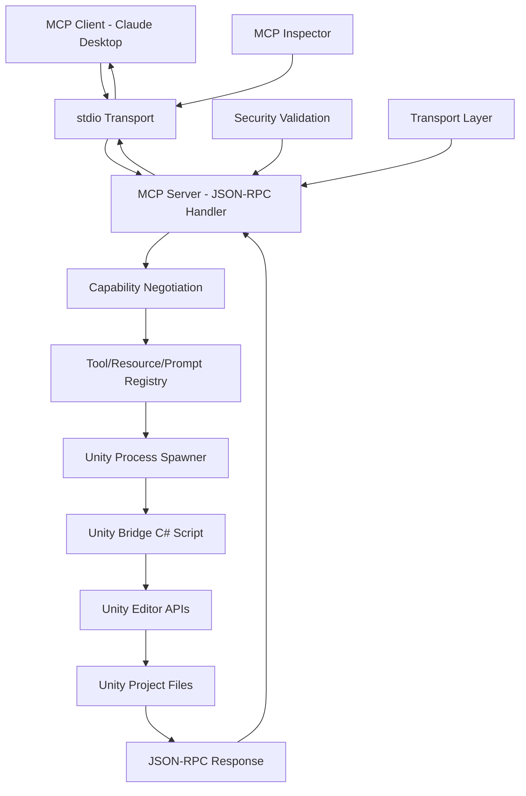

# Unity MCP Server - Product Requirements Document

## 1. Product Overview

Unity MCP (Model Context Protocol) Server là một MCP server tuân thủ chuẩn JSON-RPC 2.0, cho phép Large Language Models (LLM) tương tác an toàn với các dự án Unity thông qua các tools, resources và prompts được chuẩn hóa. <mcreference link="https://modelcontextprotocol.io/docs/concepts/transports" index="1">1</mcreference> MCP sử dụng các transport như stdio (cho local development) và HTTP với Server-Sent Events để giao tiếp giữa client và server.

Sản phẩm giải quyết vấn đề tự động hóa quy trình phát triển Unity bằng cách expose các Unity tools như build, test, asset audit thông qua MCP protocol. <mcreference link="https://modelcontextprotocol.io/docs/learn/architecture" index="2">2</mcreference> Mục tiêu là tạo ra một cầu nối chuẩn hóa giữa AI agents và Unity development workflow.

## 2. Core Features

### 2.1 User Roles

| Role | Registration Method | Core Permissions |
|------|---------------------|------------------|
| Developer | API Key authentication | Can execute all MCP tools, access project files |
| CI System | Service account token | Can run build/test operations, limited file access |
| LLM Agent | OAuth integration | Can perform automated tasks based on configured permissions |

### 2.2 Feature Module

Hệ thống Unity MCP Server bao gồm các module chính sau:

1. **MCP Protocol Handler**: JSON-RPC 2.0 message processing, capability negotiation, lifecycle management
2. **Transport Layer**: stdio transport cho local development, HTTP với SSE cho remote deployment
3. **Unity Tools**: Expose Unity operations như build, test, scene validation qua MCP tools
4. **Unity Resources**: Provide Unity project data (scenes, assets, configs) qua MCP resources
5. **Unity Prompts**: Pre-defined templates cho Unity development tasks
6. **Unity Bridge**: C# Editor scripts thực thi Unity operations và trả kết quả
7. **Security Layer**: File access control, method whitelisting, operation validation
8. **Development Integration**: Claude Desktop integration, MCP Inspector support

### 2.3 Page Details

| Component Name | Module Name | Feature description |
|----------------|-------------|---------------------|
| **MCP Tools** | project.scan | Scan Unity projects với glob patterns, trả về file metadata qua JSON-RPC |
| **MCP Tools** | build.run | Execute Unity builds cho multiple platforms, trả build results |
| **MCP Tools** | test.playmode/editmode | Run Unity tests, generate reports, collect coverage data |
| **MCP Tools** | scene.validate | Validate Unity scenes cho missing scripts, lightmaps, configuration issues |
| **MCP Tools** | asset.audit | Audit Unity assets cho optimization opportunities, import settings |
| **MCP Tools** | codegen.apply | Apply code patches tới C# files với validation và preview |
| **MCP Tools** | editor.exec | Execute Unity Editor methods và custom tools safely |
| **MCP Tools** | perf.profile | Capture Unity profiler data và performance snapshots |
| **MCP Resources** | unity.project | Provide Unity project structure và metadata |
| **MCP Resources** | unity.scenes | Access Unity scene data và hierarchy information |
| **MCP Resources** | unity.assets | Browse Unity asset database và import settings |
| **MCP Prompts** | unity.build | Pre-defined prompts cho Unity build workflows |
| **MCP Prompts** | unity.debug | Templates cho Unity debugging và troubleshooting |

## 3. Core Process

### MCP Client-Server Workflow
1. MCP Client (Claude Desktop/LLM) kết nối với MCP Server qua stdio transport <mcreference link="https://modelcontextprotocol.io/docs/concepts/transports" index="1">1</mcreference>
2. Client và Server thực hiện capability negotiation qua JSON-RPC 2.0 messages
3. Client gửi tool call request (ví dụ: build.run, test.playmode) qua JSON-RPC
4. MCP Server validate request và spawn Unity process với batch mode
5. Unity Bridge (C# script) nhận command qua STDIN, thực thi Unity APIs
6. Kết quả được trả về qua JSON-RPC response với structured data
7. Client nhận response và hiển thị kết quả cho user

### Local Development Workflow
1. Developer chạy MCP Server với stdio transport
2. Claude Desktop connect tới server qua MCP configuration
3. Developer chat với Claude, Claude sử dụng Unity tools khi cần
4. MCP Server thực thi Unity operations và trả kết quả real-time

## 4. User Interface Design

### 4.1 MCP Protocol Interface

- **Transport Layer**: stdio transport cho local development, JSON-RPC 2.0 messaging
- **Message Format**: Structured JSON với proper error handling và validation
- **Tool Responses**: Rich structured data với Unity-specific metadata
- **Resource Format**: JSON schemas cho Unity project data
- **Prompt Templates**: Markdown-formatted với Unity context

### 4.2 MCP Component Design

| Component Type | Component Name | Interface Elements |
|----------------|----------------|--------------------|  
| **MCP Tools** | project.scan | JSON response với file paths, metadata, project structure |
| **MCP Tools** | build.run | Structured build results, platform info, artifact paths |
| **MCP Tools** | test.playmode | Test results với pass/fail status, coverage data, logs |
| **MCP Resources** | unity.project | Project metadata, Unity version, platform settings |
| **MCP Resources** | unity.scenes | Scene hierarchy, GameObject data, component information |
| **MCP Prompts** | unity.build | Template prompts cho build configuration và troubleshooting |

### 4.3 Client Integration

MCP Server được thiết kế để integrate với Claude Desktop và các MCP clients khác qua stdio transport, không có web UI trực tiếp.