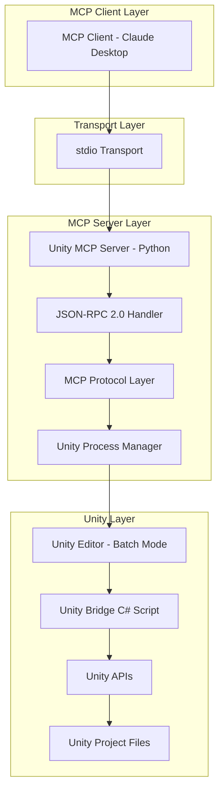
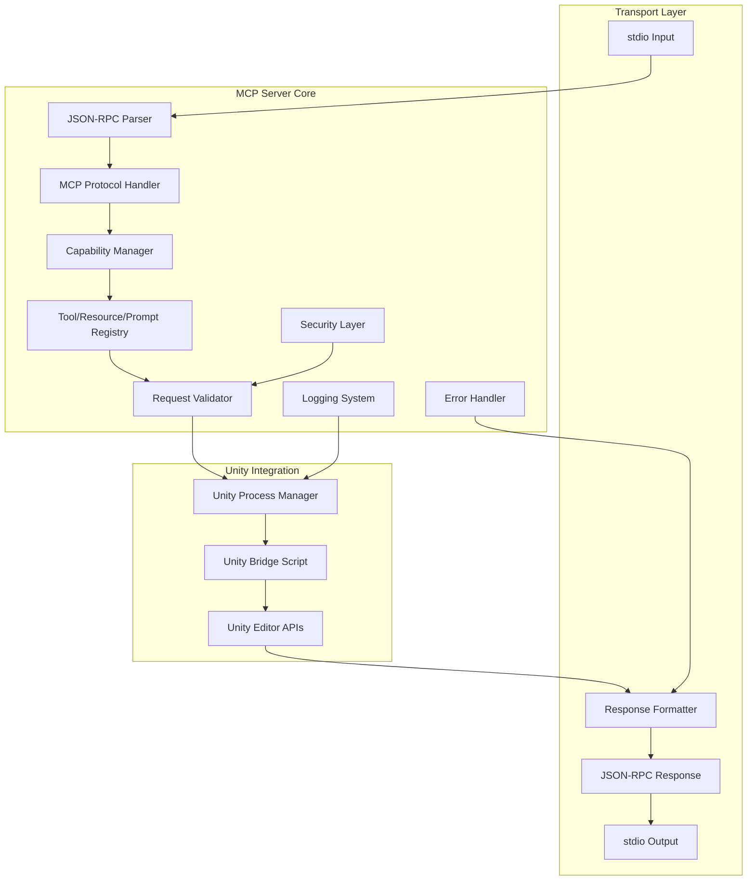

# Unity MCP Server - Technical Architecture Document

## 1. Architecture Design



## 2. Technology Description

- **MCP Server**: Python 3.11+ với FastMCP SDK
- **Transport**: stdio (JSON-RPC 2.0 over stdin/stdout)
- **Unity Integration**: Unity Editor batch mode với C# bridge script
- **Process Management**: Python subprocess với Unity CLI
- **Protocol**: Model Context Protocol (MCP) specification
- **Validation**: Pydantic models for request/response validation
- **Logging**: Python logging module with structured output
- **CI Integration**: GitHub Actions + Unity Cloud Build

## 3. MCP Component definitions

### 3.1 MCP Tools
| Tool Name | Purpose |
|-----------|---------|
| project.scan | Scan Unity project structure và return file metadata |
| build.run | Execute Unity build cho specified platform và configuration |
| test.playmode | Run Unity PlayMode tests và return results |
| test.editmode | Run Unity EditMode tests và return results |
| scene.validate | Validate Unity scenes cho common issues và missing references |
| asset.audit | Audit Unity assets cho optimization opportunities |
| codegen.apply | Apply code generation patches tới Unity C# scripts |
| editor.exec | Execute Unity Editor methods và custom tools |
| perf.profile | Capture Unity profiler data và performance snapshots |

### 3.2 MCP Resources
| Resource Name | Purpose |
|---------------|---------|
| unity://project | Unity project metadata và configuration |
| unity://scenes | Unity scene data và hierarchy information |
| unity://assets | Unity asset database và import settings |
| unity://logs | Unity console logs và build output |

### 3.3 MCP Prompts
| Prompt Name | Purpose |
|-------------|---------|
| unity.build | Template prompts cho Unity build workflows |
| unity.debug | Templates cho Unity debugging và troubleshooting |
| unity.optimize | Prompts cho Unity performance optimization |

## 4. MCP JSON-RPC Message Definitions

### 4.1 Tool Call Messages

Unity project scanning tool
```
Tool: project.scan
```

Request (JSON-RPC 2.0):
```json
{
  "jsonrpc": "2.0",
  "id": 1,
  "method": "tools/call",
  "params": {
    "name": "project.scan",
    "arguments": {
      "projectPath": "/path/to/unity/project",
      "patterns": ["**/*.cs", "**/*.prefab"],
      "includeAssets": true
    }
  }
}
```

Response (JSON-RPC 2.0):
```json
{
  "jsonrpc": "2.0",
  "id": 1,
  "result": {
    "content": [
      {
        "type": "text",
        "text": "Unity project scan completed successfully"
      },
      {
        "type": "resource",
        "resource": {
          "uri": "unity://project/files",
          "name": "Project Files",
          "mimeType": "application/json"
        }
      }
    ],
    "isError": false
  }
}
```

**Unity Build Execution**
```
POST /tool/build.run
```

Request:
| Param Name | Param Type | isRequired | Description |
|------------|------------|------------|-------------|
| target | string | true | Build target (android/ios/win64/osx/webgl) |
| scriptingBackend | string | false | Scripting backend (mono/il2cpp) |
| developmentBuild | boolean | false | Enable development build |
| outputPath | string | true | Build output directory path |
| timeoutMinutes | number | false | Build timeout in minutes |

Response:
| Param Name | Param Type | Description |
|------------|------------|-------------|
| success | boolean | Build success status |
| outputPath | string | Path to built application |
| sizeBytes | number | Build size in bytes |
| buildTime | number | Build duration in seconds |
| logs | string[] | Build log messages |

**Test Execution**
```
POST /tool/test.playmode
POST /tool/test.editmode
```

Request:
| Param Name | Param Type | isRequired | Description |
|------------|------------|------------|-------------|
| filters | object | false | Test filtering options |
| filters.categories | string[] | false | Test categories to include |
| filters.testNames | string[] | false | Specific test names to run |
| outputPath | string | true | JUnit XML output path |
| timeoutMinutes | number | false | Test timeout in minutes |
| collectCoverage | boolean | false | Collect code coverage data |

Response:
| Param Name | Param Type | Description |
|------------|------------|-------------|
| passed | number | Number of passed tests |
| failed | number | Number of failed tests |
| skipped | number | Number of skipped tests |
| junitPath | string | Path to JUnit XML report |
| coveragePath | string | Path to coverage report |

## 5. MCP Server Architecture Diagram



## 6. MCP Server State Management

### 6.1 In-Memory Data Structures

MCP Server sử dụng in-memory state management thay vì persistent database:

```python
# MCP Server State Classes
class MCPServerState:
    def __init__(self):
        self.active_operations: Dict[str, Operation] = {}
        self.unity_processes: Dict[str, UnityProcess] = {}
        self.cached_resources: Dict[str, Resource] = {}
        self.client_capabilities: Optional[ClientCapabilities] = None
        
class Operation:
    id: str
    tool_name: str
    status: OperationStatus
    start_time: datetime
    parameters: Dict[str, Any]
    result: Optional[Dict[str, Any]] = None
    error: Optional[str] = None
    
class UnityProcess:
    process_id: int
    project_path: str
    unity_version: str
    status: ProcessStatus
    created_at: datetime
    
class Resource:
    uri: str
    name: str
    mime_type: str
    content: Any
    last_updated: datetime
```

### 6.2 MCP Protocol Data Models

```python
# MCP Protocol Message Models
class ToolCallRequest:
    jsonrpc: str = "2.0"
    id: Union[str, int]
    method: str = "tools/call"
    params: ToolCallParams
    
class ToolCallParams:
    name: str
    arguments: Dict[str, Any]
    
class ToolCallResponse:
    jsonrpc: str = "2.0"
    id: Union[str, int]
    result: Optional[ToolResult] = None
    error: Optional[JsonRpcError] = None
    
class ToolResult:
    content: List[Content]
    isError: bool = False
    
class Content:
    type: str  # "text" | "image" | "resource"
    text: Optional[str] = None
    data: Optional[str] = None
    resource: Optional[ResourceReference] = None
```

### 6.3 Configuration Management

MCP Server configuration được quản lý qua Python config files:

```python
# config.py
class MCPConfig:
    # Unity Integration
    UNITY_EDITOR_PATH: str = "/Applications/Unity/Hub/Editor/2023.3.0f1/Unity.app/Contents/MacOS/Unity"
    UNITY_PROJECT_PATH: str = "/path/to/unity/project"
    UNITY_LOG_FILE: str = "/tmp/unity_mcp.log"
    
    # MCP Server Settings
    SERVER_NAME: str = "unity-mcp-server"
    SERVER_VERSION: str = "1.0.0"
    TRANSPORT: str = "stdio"  # stdio | sse
    
    # Security Settings
    ALLOWED_PATHS: List[str] = ["/path/to/unity/project"]
    BLOCKED_EXTENSIONS: List[str] = [".exe", ".dll"]
    MAX_OPERATION_TIME: int = 300  # seconds
    
    # Tool Configuration
    ENABLED_TOOLS: List[str] = [
        "project.scan",
        "build.run", 
        "test.playmode",
        "test.editmode"
    ]
```

Tài liệu đã được cập nhật để phản ánh đúng bản chất của MCP (Model Context Protocol) server thay vì HTTP server truyền thống. MCP server sử dụng JSON-RPC 2.0 protocol qua stdio transport để giao tiếp với MCP clients như Claude Desktop.